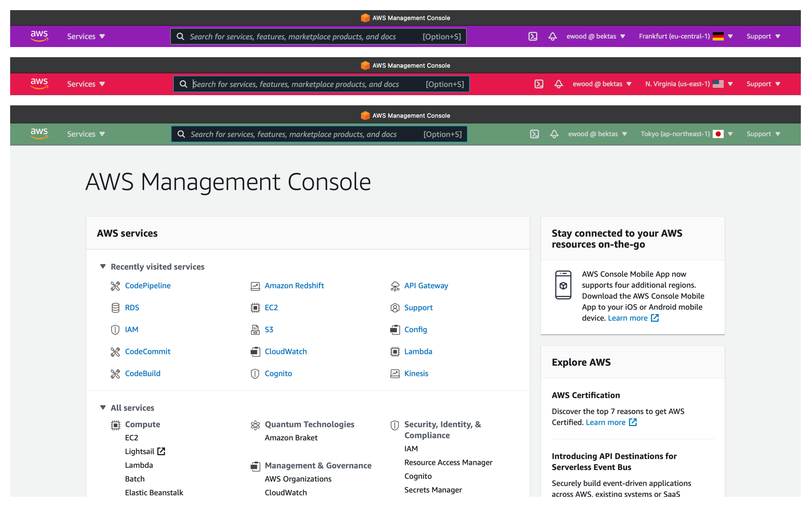

# AWS Navbar Hue - Extension for Safari

### Description
This extension for Safari changes the AWS console's navbar color depending on the region you selected. This visual hint will help you avoid creating resources in the wrong region !
It also adds the code along the region, by example for Frankfurt : eu-central-1, a number of AZs in the region and a flag corresponding to the country the region belongs to.

Remember that the console is useful but the AWS cloud is optimised for automation, thus consider using the CLI, Terraform or Cloudformation !

This extension is a slightly modified port of the work done by charon/CAPCOD found in chrome web store https://chrome.google.com/webstore/detail/aws-console-regions-color/gfeaclafcmbiakopneapkbaiifnhbkng and somewhat simplified but open-sourced version by corollari in https://github.com/corollari/aws-color-region-navbar-extension.

## Documentation

The features are the same as the Chrome and Firefox plugins.

## Installation

You can install this extension for Safari from the Mac App Store in this link https://apps.apple.com/ch/app/navbar-hue-for-aws/id1563364656?l=en&mt=12

## Donation

If you would like to support me and the costs associated with publishing the extension in the App Store you can do so here 
